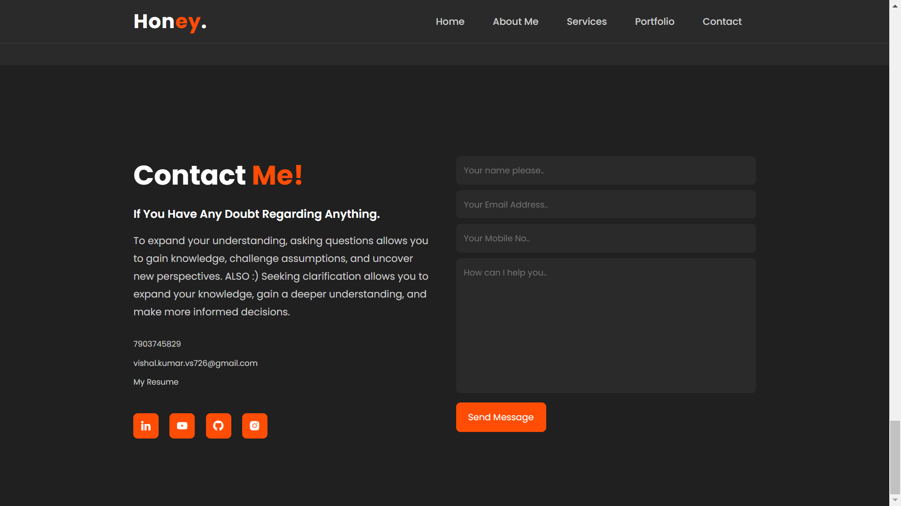
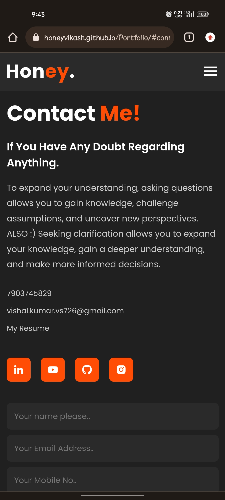
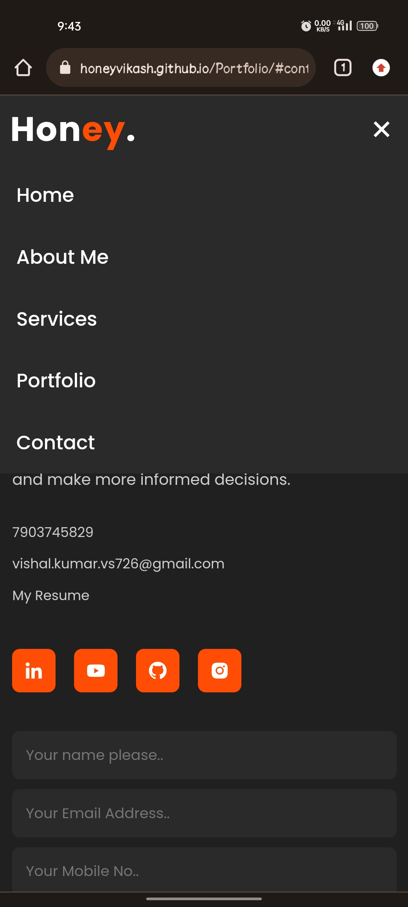

# Portfolio Website-Fully Responsive

This is a simple portfolio website created using HTML, CSS, and JavaScript. The purpose of this website is to showcase your skills, projects, and experiences to potential employers, clients, or visitors.
Live - https://honeyvikash.github.io/Portfolio/

## Sample Screenshots

## Features

- **Home**: The home page introduces you and provides a brief overview of your skills, interests, and background.

- **About**: The about page provides more detailed information about yourself, including your education, work experience, and personal interests.

- **Portfolio**: The portfolio page showcases your projects and works. Each project includes a description, images, and a link to view more details or visit the live version.

- **Contact**: The contact page allows visitors to get in touch with you. It typically includes a contact form or provides information on how to reach you via email or social media.

## Getting Started

To use or modify this portfolio website, follow these steps:

1. Clone the repository or download the source code.

2. Open the project folder in your favorite code editor.

3. Modify the HTML files (`index.html`) to add your own information, projects, and skills.

4. Customize the CSS styles by modifying the `style.css` file. You can change colors, fonts, layouts, and other visual aspects to match your preferences.

5. If you have any JavaScript functionality or interactivity, make changes to the `script.js` file accordingly.

6. Replace the sample images in the `img` folder with your own project screenshots or personal photos.

7. Test your website locally by opening the HTML files in a web browser. Make sure everything appears as expected and that there are no errors or issues.

8. Once you're satisfied with the changes, deploy the website to a web server or hosting platform of your choice. You can use services like GitHub Pages, Netlify, or Vercel for free hosting.

## Browser Compatibility

This portfolio website is designed to be compatible with modern web browsers, including Google Chrome, Mozilla Firefox, Microsoft Edge, Safari, and others. It utilizes HTML5, CSS3, and JavaScript features, so it's important to ensure that your target audience uses up-to-date browsers for the best experience.

## Credits

This portfolio website template is created by [Vikash]. Feel free to modify and customize it to suit your needs. If you have any questions or suggestions, you can reach me at [vishal.kumar.vs726@gmail.com].

## License

This project is licensed under the [MIT License](https://opensource.org/licenses/MIT). You are free to use, modify, and distribute this code for personal or commercial purposes. Attribution is not required, but it's highly appreciated.
